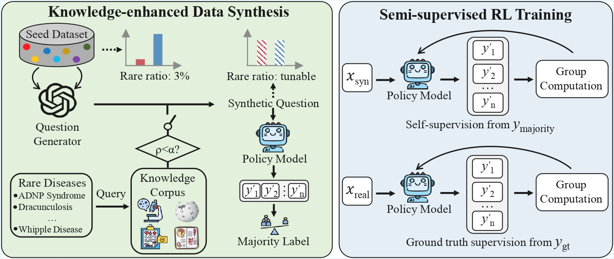

<div align="center">

# [ACL 2026] MedSSR

[](#)
[](https://huggingface.co/tdlhl/MedSSR-Qwen3-8B-Base)
[](https://huggingface.co/datasets/tdlhl/RareDis-Sub)

**This is the code repository for our ACL 2026 Findings paper [Eliciting Medical Reasoning with Knowledge-enhanced Data Synthesis: A Semi-Supervised Reinforcement Learning Approach](https://to-be-fill).**

</div>

## News

- `[TODO]` Paper link
- `[TODO]` Hugging Face model link
- `[TODO]` Dataset link

## Overview



We proposes **MedSSR**, a framework that combines:

- **Knowledge-enhanced data synthesis** with controllable rare-disease knowledge injection.
- **A two-stage semi-supervised RLVR pipeline**:
  first self-supervised RL on pseudo-labeled synthetic data, then supervised RL on human-annotated real data.

## Environment

Our environment is provided in `MedSSR.yml` (conda) and `requirements.txt` (pip).

Some key requirements:

```text
torch==2.6.0+cu124
transformers==4.52.4
vllm==0.8.5.post1
verl==0.3.1
```

To install:

```bash
conda env create -f MedSSR.yml
conda activate MedSSR
```

## Dataset

Our test datasets are provided in [`data`](./data) folder.

Input data should be a JSON list. Each sample should contain at least the following fields:

```json
{
  "id": "unique-id",
  "question": "Question text with answer options",
  "gold": "A",
  "name": "dataset_name"
}
```

See [`data/test_short_medqa.json`](./data/test_short_medqa.json) for an example.

## Evaluation

### Option 1: Run the example script

We apply logit bias in a second decoding pass to avoid invalid outputs.
The provided launcher can evaluate multiple datasets from a single script:

```bash
MODEL_PATH=/path/to/your/model \
bash scripts/run_example.sh
```

You can also override:

```bash
MODEL_PATH=/path/to/your/model \
BASE_OUTPUT_DIR=./outputs \
DATASET_DIR=./data \
bash scripts/run_example.sh
```

### Option 2: Run the Python script directly

```bash
python vllm_logitsbias_multi.py \
  --model /path/to/your/model \
  --dataset data/test_short_medqa.json \
  --question_type mcq \
  --temperature 0.6 \
  --top_p 0.95 \
  --top_k 20 \
  --max_tokens 2048 \
  --num_generations 4 \
  --output_prefix outputs/sample_run
```

## Training

For the training pipeline, we use the [verl](https://github.com/verl-project/verl) framework.

## Citation

Please update this section with the final ACL 2026 Findings citation.

```bibtex
@inproceedings{medssr2026,
  title={Eliciting Medical Reasoning with Knowledge-enhanced Data Synthesis: A Semi-Supervised Reinforcement Learning Approach},
  author={[TODO]},
  booktitle={Findings of the Association for Computational Linguistics: ACL 2026},
  year={2026}
}
```
